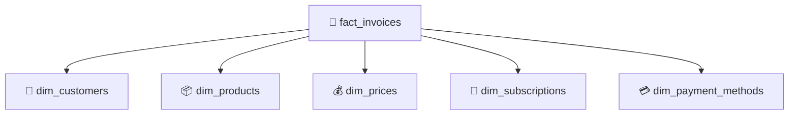

# 🎯 Pourquoi `fact_invoices` comme étoile de l'OLAP ?

## 📋 Résumé Exécutif

Dans notre architecture OLAP Stripe, nous avons choisi **`fact_invoices`** comme table de faits centrale plutôt que `customers` ou d'autres entités. Ce document explique la logique métier et technique derrière cette décision architecturale.

---

## 🤔 Les Alternatives Considérées

### Option 1: `fact_customers` ❌
**Pourquoi pas les customers comme étoile ?**

- **Granularité inadéquate** : Un customer ne représente qu'**un seul événement** (inscription)
- **Peu de métriques business** : Difficulté d'analyser les revenus, volumes, conversions dans le temps
- **Relation 1:N complexe** : Un customer a plusieurs invoices → perte de granularité transactionnelle
- **Analytics limitées** : Impossible de faire des analyses temporelles fines (revenus mensuels, saisonnalité)

```sql
-- ❌ Difficile avec fact_customers
SELECT customer_id, SUM(revenue) FROM fact_customers 
GROUP BY customer_id, month
-- Problème: le revenue est au niveau invoice, pas customer
```

### Option 2: `fact_subscriptions` ⚠️
**Pourquoi pas les subscriptions ?**

- **Lifecycle incomplet** : Les subscriptions ne capturent que l'intention, pas la réalisation financière
- **One-time payments exclus** : Certains paiements Stripe ne passent pas par des subscriptions
- **Granularité imparfaite** : Une subscription génère plusieurs invoices dans le temps

---

## ✅ Pourquoi `fact_invoices` est le Bon Choix

### 🎯 1. **Granularité Business Optimale**

```python
# Chaque ligne = un événement de facturation
invoice_row = {
    "invoice_id": "in_1234",
    "amount_paid": 2999,  # 29.99€
    "period_start": "2025-01-01",
    "period_end": "2025-02-01",
    "status": "paid"
}
```

- **1 invoice = 1 transaction business** 
- Capture l'**événement de revenus** au bon niveau de détail
- Permet l'analyse temporelle fine (journalière, mensuelle, trimestrielle)

### 💰 2. **Métrique de Revenus Native**

Les invoices contiennent directement les **KPIs business critiques** :

| Métrique | Colonne Invoice | Usage Analytics |
|----------|----------------|-----------------|
| **Chiffre d'affaires** | `amount_paid` | Revenue mensuel, YoY growth |
| **Volume transactions** | COUNT(*) | Nombre de factures/période |
| **Panier moyen** | AVG(`amount_paid`) | Price analysis |
| **Statut de paiement** | `status` | Taux de succès, échecs |

```sql
-- ✅ Analytics naturelles avec fact_invoices
SELECT 
    DATE_TRUNC('month', created_at) as month,
    SUM(amount_paid) as monthly_revenue,
    COUNT(*) as invoice_volume,
    AVG(amount_paid) as avg_order_value
FROM fact_invoices 
WHERE status = 'paid'
GROUP BY month;
```

### 🔗 3. **Hub Relationnel Parfait**

Les invoices sont le **point de convergence** de tous les objets Stripe :



**Jointures naturelles** pour l'analyse multidimensionnelle :
- Revenue **par customer** → `JOIN dim_customers`
- Revenue **par produit** → `JOIN dim_products` 
- Revenue **par plan tarifaire** → `JOIN dim_prices`
- Performance **par méthode de paiement** → `JOIN dim_payment_methods`

### ⚡ 4. **Performance Queries Optimisée**

```sql
-- Requête typique d'un dashboard business
SELECT 
    p.name as product_name,
    SUM(f.amount_paid) as revenue,
    COUNT(f.invoice_id) as transaction_count
FROM fact_invoices f
JOIN dim_products p ON f.product_id = p.product_id
WHERE f.created_at >= '2025-01-01'
  AND f.status = 'paid'
GROUP BY p.name
ORDER BY revenue DESC;
```

- **Scans efficaces** : Filtrages temporels sur `created_at`
- **Agrégations directes** : `SUM(amount_paid)` sans calculs complexes
- **Jointures 1:1** : Pas de duplications, résultats cohérents

---

## 🧠 Considérations Architecturales

### 📊 **Modélisation Dimensionnelle**

Notre choix suit les **bonnes pratiques Kimball** :

1. **Fact = Mesures + Clés étrangères**
   - ✅ `amount_paid`, `status` = mesures business
   - ✅ `customer_id`, `product_id` = clés vers dimensions

2. **Dimensions = Contexte + Attributs**
   - ✅ `dim_customers` : email, currency, statut client
   - ✅ `dim_products` : nom, description produit

3. **Granularité stable**
   - ✅ 1 invoice = 1 ligne, pas de changement de grain

### 🔄 **Cycle de Vie Stripe**

L'invoice capture le **moment décisif** du funnel :

```
Customer → Subscription → INVOICE → Payment → Receipt
                           ⭐ 
                    Point de revenus
```

- **Avant l'invoice** : Intention (subscription)
- **Avec l'invoice** : Engagement financier 
- **Après l'invoice** : Confirmation (payment/charge)

### 🎯 **Use Cases Analytics Supportés**

| Question Business | Requête avec fact_invoices |
|------------------|----------------------------|
| *"Quel est le CA mensuel par produit ?"* | `GROUP BY month, product_id` |
| *"Quels clients génèrent le plus de revenus ?"* | `GROUP BY customer_id ORDER BY SUM(amount_paid)` |
| *"Quel est le taux de paiement par méthode ?"* | `GROUP BY payment_method_type, status` |
| *"Évolution saisonnière des revenus ?"* | `GROUP BY EXTRACT(month FROM created_at)` |

---

## 📈 Validation par les Tests

Notre choix est validé par les **tests automatisés** :

```python
def test_csv_shape_vs_invoices(raw_json_dump, olap_outputs):
    """Chaque invoice JSON = exactement 1 ligne fact_invoices"""
    expected_len = len(raw_json_dump["invoices"]) 
    actual_len = len(olap_outputs["fact_invoices"])
    assert actual_len == expected_len
```

**Assurance qualité** :
- ✅ **Granularité 1:1** : Pas de perte/duplication de données
- ✅ **Intégrité référentielle** : Toutes les jointures sont valides  
- ✅ **Types cohérents** : `amount_paid` = integer, `livemode` = boolean

---

## 🚀 Bénéfices Concrets

### Pour les **Data Analysts** :
- Requêtes intuitives et performantes
- Jointures simples vers les dimensions
- Métriques business disponibles nativement

### Pour les **Business Users** :
- Dashboards responsive (Streamlit + MongoDB)
- KPIs temps réel : revenus, conversions, volumes
- Segmentation flexible : par customer, produit, période

### Pour les **Data Engineers** :
- Pipeline ETL simple : 1 invoice JSON → 1 ligne fact
- Tests automatisés sur la granularité
- Évolutivité : nouvelles dimensions sans impact sur la fact

---

## 🎯 Conclusion

**`fact_invoices` comme étoile OLAP** n'est pas un choix arbitraire, mais une décision architecturale qui :

1. **Respecte la granularité business** (1 transaction = 1 invoice)
2. **Optimise les analytics** (revenus, volumes, conversions) 
3. **Facilite les jointures** (hub relationnel naturel)
4. **Assure la performance** (scans temporels, agrégations directes)

Cette approche nous permet de répondre aux questions business critiques tout en maintenant une architecture OLAP évolutive et performante.

---

*💡 **Rappel** : Ce document fait partie de la stack complète documentée dans [`docs/fact_dim.md`](fact_dim.md) et validée par les tests dans [`tests/`](../tests/)*
