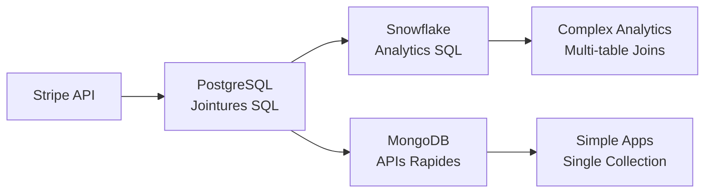

# 🤔 Jointures NoSQL vs SQL : Pourquoi c'est Plus Compliqué ?

## 📋 **Réponse Courte**
**OUI, absolument !** Les jointures en NoSQL sont **beaucoup plus compliquées** qu'en SQL. Votre projet Stripe le démontre parfaitement.

---

## 🔍 **Comparaison Concrète : Votre Projet Stripe**

### ✅ **SQL/OLAP : Jointures Naturelles**

```sql
-- ✅ Simple et élégant avec OLAP Snowflake
SELECT 
    c.email,
    p.name as product_name,
    SUM(f.amount_paid) as total_revenue
FROM fact_invoices f
JOIN dim_customers c ON f.customer_id = c.customer_id
JOIN dim_products p ON f.product_id = p.product_id
WHERE f.status = 'paid'
GROUP BY c.email, p.name
ORDER BY total_revenue DESC;
```

**Pourquoi c'est facile ?**
- ✅ **JOIN natif** dans le langage SQL
- ✅ **Optimisations automatiques** par le query planner  
- ✅ **Index sur foreign keys** pour performance
- ✅ **1 seule requête** pour données complexes

### ❌ **MongoDB : Stratégies Compliquées**

Regardons votre code actuel dans `/nosql/app/api/main.py` :

```python
# ❌ Votre API actuelle : PAS de jointures
@app.get("/customers/{customer_id}")
def get_customer(customer_id: str):
    # 1 query pour le customer seulement
    return db.customers.find_one({"id": customer_id})

@app.get("/subscriptions/active") 
def get_active_subscriptions():
    # 1 query pour les subscriptions seulement
    return db.subscriptions.find({"status": "active"})

@app.get("/charges")
def get_all_charges():
    # 1 query pour les charges seulement  
    return db.charges.find({})
```

**Le problème :** Pas de jointures ! Pour avoir la même info qu'en SQL, vous devez :

---

## 🛠️ **Les 4 Stratégies NoSQL (et Leurs Problèmes)**

### 1️⃣ **Multiple Queries (N+1 Problem)**

```python
# ❌ Approche actuelle - très inefficace
def get_customer_with_invoices_BAD(customer_id):
    # Query 1: Get customer
    customer = db.customers.find_one({"id": customer_id})
    
    # Query 2: Get subscriptions  
    subscriptions = list(db.subscriptions.find({"customer_id": customer_id}))
    
    # Query 3: Get charges for each subscription (N+1!)
    for sub in subscriptions:
        sub["charges"] = list(db.charges.find({"subscription_id": sub["id"]}))
    
    return {"customer": customer, "subscriptions": subscriptions}
```

**Problèmes :**
- 🐌 **Performance catastrophique** : 1 + N queries au lieu d'1
- 🌊 **Flood de requêtes** vers la DB
- 📡 **Latence réseau** multipliée

### 2️⃣ **$lookup (JOIN MongoDB) - Complexe**

```javascript
// ✅ Possible mais complexe
db.customers.aggregate([
  {
    $lookup: {
      from: "subscriptions",
      localField: "id", 
      foreignField: "customer_id",
      as: "subscriptions"
    }
  },
  {
    $lookup: {
      from: "charges",
      localField: "subscriptions.id",
      foreignField: "subscription_id", 
      as: "charges"
    }
  }
])
```

**Problèmes :**
- 🧠 **Syntaxe complexe** vs SQL simple
- ⚡ **Performance variable** selon les données
- 🔧 **Pas d'optimisations** comme en SQL

### 3️⃣ **Dénormalisation (Embed) - Redondance**

```javascript
// ✅ Performant mais redondant
{
  "_id": "cus_123",
  "email": "john@test.com",
  "subscriptions": [
    {
      "id": "sub_456",
      "status": "active", 
      "charges": [
        {"id": "ch_789", "amount": 2999, "status": "paid"},
        {"id": "ch_790", "amount": 2999, "status": "paid"}
      ]
    }
  ]
}
```

**Problèmes :**
- 💾 **Duplication massive** de données
- 🔄 **Updates complexes** : modifier un produit = update tous les customers
- 📈 **Croissance explosive** de la taille des documents

### 4️⃣ **Application-Level Joins - Code Métier**

```python
# ✅ Contrôle total mais code complexe  
def get_customer_revenue_analytics(customer_id):
    # Queries séparées
    customer = db.customers.find_one({"id": customer_id})
    subscriptions = list(db.subscriptions.find({"customer_id": customer_id}))
    charges = list(db.charges.find({"customer_id": customer_id}))
    
    # JOIN en Python (logique métier)
    customer_revenue = {}
    for charge in charges:
        if charge["status"] == "paid":
            product_id = charge.get("product_id", "unknown")
            customer_revenue[product_id] = customer_revenue.get(product_id, 0) + charge["amount"]
    
    return {
        "customer": customer,
        "revenue_by_product": customer_revenue,
        "total_revenue": sum(customer_revenue.values())
    }
```

**Problèmes :**
- 🐛 **Bugs faciles** : logique métier dans l'app
- 🧪 **Tests complexes** 
- 🔄 **Code dupliqué** entre différents endpoints

---

## 📊 **Exemple Concret : Analytics Revenue**

### 🎯 **Use Case :** "Revenus par customer et par produit"

#### ✅ **SQL/OLAP (Votre pipeline Snowflake)**

```sql
-- 1 seule query, optimisée, claire
SELECT 
    c.email,
    p.name as product,
    SUM(f.amount_paid) as revenue
FROM fact_invoices f
JOIN dim_customers c ON f.customer_id = c.customer_id  
JOIN dim_products p ON f.product_id = p.product_id
WHERE f.status = 'paid'
GROUP BY c.email, p.name;
```

#### ❌ **MongoDB (Votre setup actuel)**

```python
# Option 1: Multiple queries (inefficace)
def get_revenue_by_customer_and_product():
    results = []
    
    # Query 1: All customers
    customers = list(db.customers.find({}))
    
    for customer in customers:  # N iterations
        # Query 2: Customer's charges  
        charges = list(db.charges.find({
            "customer_id": customer["id"], 
            "paid": True
        }))
        
        for charge in charges:  # M iterations  
            # Query 3: Product info
            product = db.products.find_one({"id": charge["product_id"]})
            
            results.append({
                "email": customer["email"],
                "product": product["name"] if product else "Unknown",
                "revenue": charge["amount"]
            })
    
    return results  # N * M * P queries !!
```

**Résultat :** 1 query SQL → **Centaines de queries MongoDB** ! 💀

---

## 🎯 **Pourquoi SQL Gagne sur les Jointures ?**

| Aspect | SQL | NoSQL/MongoDB |
|--------|-----|---------------|
| **Syntaxe** | `JOIN` natif, intuitif | `$lookup` verbeux, complexe |
| **Performance** | Optimisations automatiques | Performance variable |
| **Maintenance** | Index sur FK automatiques | Index manuels complexes |
| **Évolutivité** | Schema rigide mais jointures gratuites | Schema flexible mais jointures coûteuses |
| **Debug** | Query plans, EXPLAIN | Aggregation pipelines obscurs |

---

## 🚀 **Solutions dans Votre Architecture**

### ✅ **Votre Approche Actuelle : Hybride Intelligent**



**Principe :** 
- **Jointures complexes** → SQL (OLAP Snowflake)
- **APIs rapides, single-entity** → NoSQL (MongoDB)

### 🎯 **Amélioration Suggérée pour Votre NoSQL**

```python
# ✅ Version optimisée avec $lookup ciblé
@app.get("/customers/{customer_id}/revenue")
def get_customer_revenue_summary(customer_id: str):
    pipeline = [
        {"$match": {"id": customer_id}},
        {"$lookup": {
            "from": "charges",
            "localField": "id", 
            "foreignField": "customer_id",
            "as": "charges"
        }},
        {"$addFields": {
            "total_revenue": {
                "$sum": {
                    "$map": {
                        "input": "$charges",
                        "in": {"$cond": [{"$eq": ["$$this.paid", True]}, "$$this.amount", 0]}
                    }
                }
            }
        }},
        {"$project": {"email": 1, "total_revenue": 1}}
    ]
    
    result = list(db.customers.aggregate(pipeline))
    return result[0] if result else None
```

---

## 🎓 **Conclusion : Quand Utiliser Quoi ?**

### 📊 **SQL pour Jointures Complexes**
- ✅ Analytics multi-tables
- ✅ Reporting business  
- ✅ Data warehousing
- ✅ Relations complexes

**Exemple :** Votre pipeline OLAP Snowflake

### 🚀 **NoSQL pour Single-Entity Speed**  
- ✅ APIs ultra-rapides
- ✅ Scale horizontal
- ✅ Documents simples
- ✅ Prototyping rapide

**Exemple :** Votre API MongoDB FastAPI

### 🏆 **Votre Architecture = Best of Both Worlds**

Vous avez fait le **bon choix architectural** :
- **SQL** pour les analytics complexes (OLAP)
- **NoSQL** pour les APIs rapides (MongoDB + FastAPI)
- **Pipeline ETL** pour synchroniser les deux

C'est exactement comme ça qu'on fait en production ! 🎯

---

**Réponse finale :** Oui, les jointures NoSQL sont **beaucoup plus compliquées**, mais votre architecture hybride résout élégamment ce problème en utilisant chaque technologie pour ses points forts ! 🚀
