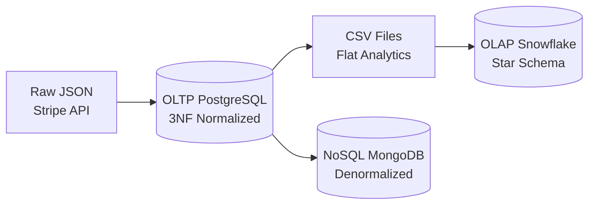

# 📚 Révision Rapide : Granularité, Normalisation & Formats de Données

## 🎯 Granularité des Données

### 🔍 **Définition**
La granularité = **niveau de détail** des données stockées dans une table.

| Niveau | Granularité | Exemple Stripe | Usage |
|--------|-------------|----------------|-------|
| **Très Fine** | 1 ligne = 1 événement | `fact_invoices` (1 invoice = 1 ligne) | Analytics détaillées |
| **Fine** | 1 ligne = 1 transaction | `charges` (1 paiement = 1 ligne) | Suivi transactionnel |
| **Moyenne** | 1 ligne = 1 entité | `customers` (1 client = 1 ligne) | Gestion clients |
| **Agrégée** | 1 ligne = résumé | `monthly_revenue` (1 mois = 1 ligne) | Dashboards exec |

### ⚖️ **Trade-offs Granularité**

```sql
-- ✅ Granularité Fine (fact_invoices)
SELECT customer_id, DATE_TRUNC('month', created_at), SUM(amount_paid)
FROM fact_invoices GROUP BY 1,2;
-- Avantage: Flexibilité maximale
-- Inconvénient: Volume de données important

-- ✅ Granularité Agrégée (pre-calc)
SELECT customer_id, month, total_revenue 
FROM monthly_customer_revenue;
-- Avantage: Queries ultra-rapides
-- Inconvénient: Perte de flexibilité
```

---

## 🗂️ Formes Normales (1F, 2F, 3F)

### 🎯 **1ère Forme Normale (1NF)**
**Règle** : Chaque cellule contient **une seule valeur atomique**

```sql
-- ❌ Violation 1NF
CREATE TABLE customers_bad (
    id TEXT,
    emails TEXT  -- "john@test.com,john.doe@gmail.com" 
);

-- ✅ Respect 1NF  
CREATE TABLE customers (
    id TEXT,
    email TEXT  -- Une seule valeur
);
CREATE TABLE customer_emails (
    customer_id TEXT,
    email TEXT
);
```

### 🎯 **2ème Forme Normale (2NF)**
**Règle** : 1NF + **Pas de dépendance partielle** à la clé primaire

```sql
-- ❌ Violation 2NF
CREATE TABLE invoice_lines (
    invoice_id TEXT,
    line_number INTEGER,
    product_name TEXT,    -- Dépend seulement de product_id
    product_id TEXT,
    quantity INTEGER,
    PRIMARY KEY (invoice_id, line_number)
);

-- ✅ Respect 2NF
CREATE TABLE invoice_lines (
    invoice_id TEXT,
    line_number INTEGER,
    product_id TEXT,
    quantity INTEGER,
    PRIMARY KEY (invoice_id, line_number)
);
CREATE TABLE products (
    product_id TEXT PRIMARY KEY,
    product_name TEXT
);
```

### 🎯 **3ème Forme Normale (3NF)**
**Règle** : 2NF + **Pas de dépendance transitive**

```sql
-- ❌ Violation 3NF
CREATE TABLE customers (
    customer_id TEXT,
    city TEXT,
    country TEXT,        -- Dépend de city (transitif)
    postal_code TEXT     -- Dépend de city (transitif)
);

-- ✅ Respect 3NF
CREATE TABLE customers (
    customer_id TEXT,
    address_id TEXT
);
CREATE TABLE addresses (
    address_id TEXT,
    city TEXT,
    country TEXT,
    postal_code TEXT
);
```

---

## 🏗️ OLTP vs OLAP vs NoSQL

### 💾 **OLTP (Online Transaction Processing)**

```python
# Exemple: Enregistrer un nouveau paiement
def create_invoice(customer_id, amount):
    # ✅ ACID compliance
    with transaction():
        invoice = Invoice(customer_id=customer_id, amount=amount)
        db.add(invoice)
        update_customer_balance(customer_id, amount)
        db.commit()
```

| ✅ **Avantages** | ❌ **Inconvénients** |
|------------------|---------------------|
| **Cohérence ACID** | **Analytics lentes** |
| **Writes rapides** | **Queries complexes difficiles** |
| **Intégrité référentielle** | **Pas optimisé pour agrégations** |
| **Normalisation** | **Locks sur writes concurrents** |

**Usage** : Applications transactionnelles (e-commerce, banking)

### 📊 **OLAP (Online Analytical Processing)**

```sql
-- Exemple: Analyse revenus trimestriels
SELECT 
    DATE_TRUNC('quarter', created_at) as quarter,
    product_name,
    SUM(amount_paid) as revenue,
    COUNT(*) as invoice_count
FROM fact_invoices f
JOIN dim_products p ON f.product_id = p.product_id
GROUP BY quarter, product_name
ORDER BY quarter, revenue DESC;
```

| ✅ **Avantages** | ❌ **Inconvénients** |
|------------------|---------------------|
| **Analytics ultra-rapides** | **Updates complexes** |
| **Requêtes complexes optimisées** | **Redondance données** |
| **Agrégations natives** | **ETL pipeline nécessaire** |
| **Historisation** | **Storage plus important** |

**Usage** : Business Intelligence, reporting, analytics

### 🌐 **NoSQL (Document/Key-Value)**

```javascript
// Exemple: Stockage document MongoDB
{
  "_id": "cus_123",
  "email": "john@test.com",
  "subscriptions": [
    {
      "id": "sub_456", 
      "status": "active",
      "invoices": [
        {"id": "in_789", "amount": 2999, "status": "paid"}
      ]
    }
  ]
}
```

| ✅ **Avantages** | ❌ **Inconvénients** |
|------------------|---------------------|
| **Flexibilité schéma** | **Pas de joins natifs** |
| **Scale horizontal** | **Cohérence éventuelle** |
| **Performance reads** | **Requêtes complexes limitées** |
| **Nested data native** | **Redondance et sync** |

**Usage** : APIs rapides, données semi-structurées, microservices

---

## 📄 Formats de Fichiers

### 🔧 **JSON (JavaScript Object Notation)**

```json
{
  "invoice_id": "in_1234", 
  "customer": {
    "id": "cus_5678",
    "email": "john@test.com"
  },
  "lines": [
    {"product_id": "prod_abc", "amount": 2999}
  ]
}
```

| ✅ **Avantages** | ❌ **Inconvénients** |
|------------------|---------------------|
| **Lisible humainement** | **Verbose (taille)** |
| **Nested structures** | **Parsing overhead** |
| **Standard web** | **Pas de schéma strict** |
| **Flexible** | **Types limités** |

**Usage** : APIs, configuration, données semi-structurées

### 📊 **CSV (Comma-Separated Values)**

```csv
invoice_id,customer_id,amount_paid,status,created_at
in_1234,cus_5678,2999,paid,2025-01-15T10:30:00Z
in_1235,cus_5679,4999,pending,2025-01-15T11:45:00Z
```

| ✅ **Avantages** | ❌ **Inconvénients** |
|------------------|---------------------|
| **Compact** | **Flat seulement** |
| **Universal support** | **Pas de types** |
| **Streaming friendly** | **Escape complexe** |
| **Excel compatible** | **Pas de métadonnées** |

**Usage** : Data export, ETL, analytics tools

### 🗄️ **Parquet (Columnar)**

```python
# Structure optimisée pour analytics
df.to_parquet('invoices.parquet', 
              compression='snappy',
              index=False)
```

| ✅ **Avantages** | ❌ **Inconvénients** |
|------------------|---------------------|
| **Compression excellente** | **Pas lisible humainement** |
| **Columnar storage** | **Write overhead** |
| **Types stricts** | **Complexité tooling** |
| **Analytics optimisé** | **Pas de updates** |

**Usage** : Data lakes, big data, analytics pipelines

---

## 🔍 Méthodes de Requêtage

### 🗃️ **SQL Structuré**

```sql
-- Requête relationnelle classique
SELECT c.email, SUM(i.amount_paid) as total_revenue
FROM customers c
JOIN invoices i ON c.id = i.customer_id  
WHERE i.status = 'paid'
GROUP BY c.email
ORDER BY total_revenue DESC;
```

**Caractéristiques** :
- ✅ Joins efficaces, agrégations optimisées
- ✅ ACID compliance, transactions
- ❌ Schéma rigid, pas de nested data

### 🌊 **Semi-Structuré (JSON dans SQL)**

```sql
-- PostgreSQL JSONB
SELECT 
    id,
    stripe_metadata->>'customer_type' as customer_type,
    jsonb_array_length(lines->'data') as line_count
FROM invoices 
WHERE stripe_metadata ? 'vip_customer';
```

**Caractéristiques** :
- ✅ Flexibilité + structure
- ✅ Indexes sur JSON paths
- ❌ Performance variable selon queries

### 🍃 **NoSQL (MongoDB)**

```javascript
// Aggregation pipeline
db.customers.aggregate([
  {$match: {"subscriptions.status": "active"}},
  {$unwind: "$subscriptions"},
  {$group: {
    _id: "$email",
    total_revenue: {$sum: "$subscriptions.amount"}
  }},
  {$sort: {total_revenue: -1}}
]);
```

**Caractéristiques** :
- ✅ Nested data native
- ✅ Horizontal scaling  
- ❌ Pas de joins, aggregations limitées

---

## 🎯 Choix Architecture dans notre Projet Stripe

### 📊 **Pipeline Complet**



### 🎯 **Rationale par Couche**

| Couche | Format | Granularité | Justification |
|--------|--------|-------------|---------------|
| **OLTP** | SQL 3NF | Fine (1 invoice = 1 row) | Transactions ACID, intégrité |
| **OLAP** | SQL Star | Fine + Dim | Analytics rapides, joins optimisées |
| **NoSQL** | JSON Document | Agrégée par customer | APIs rapides, UI responsive |
| **Export** | CSV | Fine | Interopérabilité, portabilité |

### 🚀 **Performance par Use Case**

| Use Case | Meilleur Choix | Exemple |
|----------|----------------|---------|
| **Enregistrer paiement** | OLTP (PostgreSQL) | `INSERT INTO invoices...` |
| **Dashboard revenus** | OLAP (Snowflake) | `SELECT SUM(amount_paid)...` |  
| **API customer profile** | NoSQL (MongoDB) | `db.customers.findOne({id})` |
| **Export comptabilité** | CSV | Plat, Excel-compatible |

---

## 🎓 **Résumé Synthèse**

- **1F/2F/3F** : Niveaux de normalisation pour éliminer redondance
- **OLTP** : Transactions rapides, cohérence ACID  
- **OLAP** : Analytics rapides, star schema
- **NoSQL** : Flexibilité, scale horizontal
- **JSON** : Interchange flexible, nested data
- **CSV** : Portable, plat, analytics-friendly
- **SQL** : Queries complexes, joins efficaces
- **Semi-structuré** : Hybride structure + flexibilité

Le choix dépend du **use case** : transactions → OLTP, analytics → OLAP, APIs → NoSQL ! 🎯
