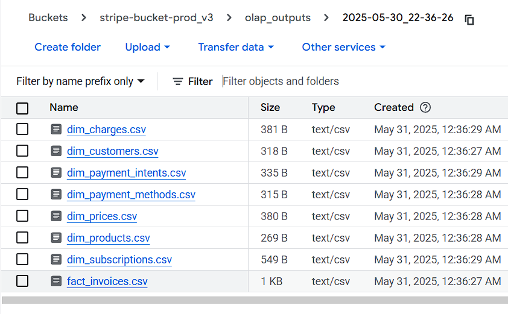
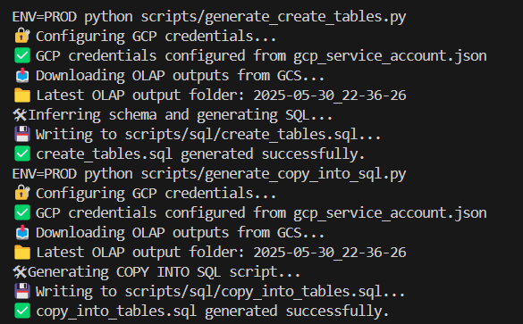
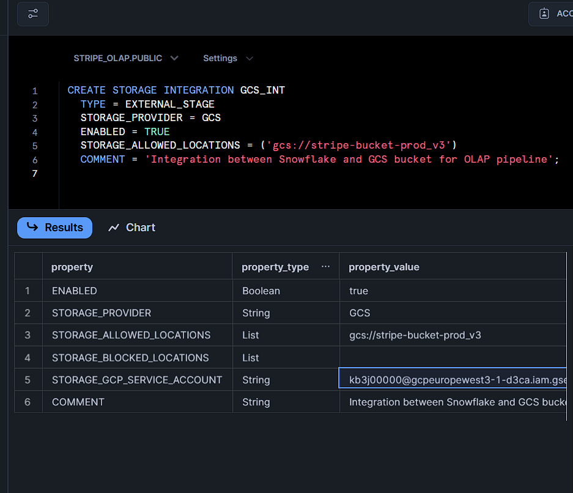
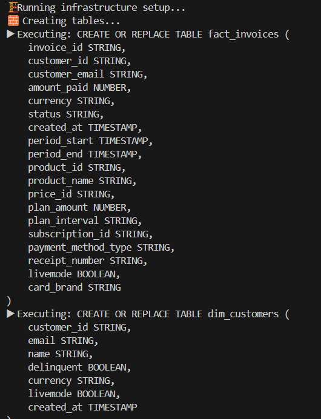
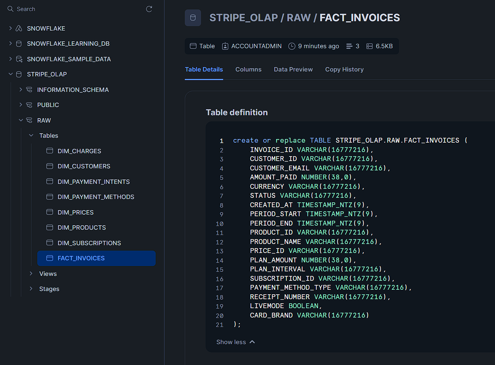
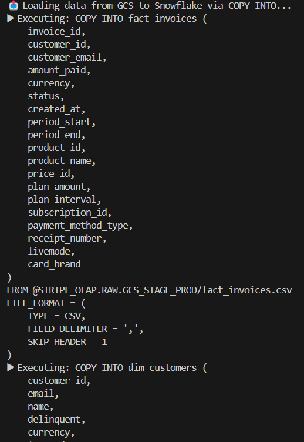
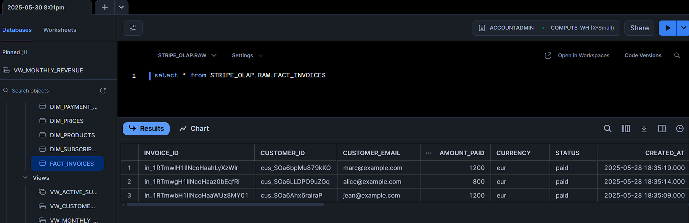
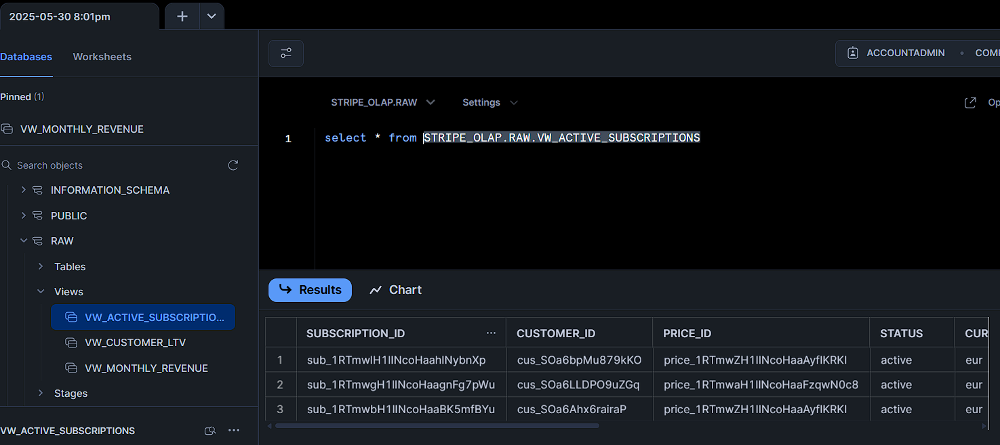
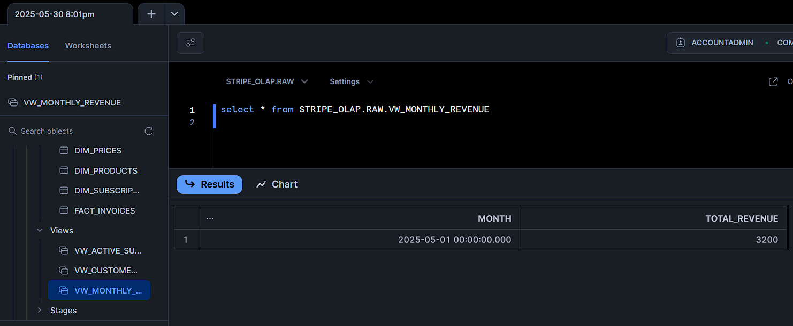

# 📘 Snowflake Integration for the OLAP Pipeline

## 🧭 Goal

This document outlines how Snowflake is integrated into the OLAP ETL process. It explains:

- What Snowflake is and how we use it  
- How we connect and authenticate  
- How data is dynamically loaded from GCS  
- How infrastructure, tables, and views are versioned and deployed  
- The available Makefile targets to automate everything  

---

## ❄️ What is Snowflake?

[Snowflake](https://www.snowflake.com/) is a cloud-native data warehouse designed for scalability and flexible data access.

For this OLAP project, Snowflake acts as the **destination layer**. Transformed data is loaded there in the form of:

- `fact_` tables (e.g., `fact_invoices`)  
- `dim_` tables (e.g., `dim_customers`)  
- `vw_` views for analysis  

---

## 🔐 Configuration

We authenticate to Snowflake via environment variables stored in `.env.snowflake`:

```ini
SNOWFLAKE_USER=<your-username>
SNOWFLAKE_PASSWORD=<your-password>
SNOWFLAKE_ACCOUNT=<your-account>
SNOWFLAKE_DATABASE=STRIPE_OLAP
SNOWFLAKE_SCHEMA=RAW
SNOWFLAKE_WAREHOUSE=WH_STRIPE_OLAP
```

These credentials are loaded automatically by the ETL scripts.

> You can retrieve them via the Snowflake UI under `Account Details`.

---

## ⚙️ Connecting from Python

We use the official `snowflake-connector-python` package to run SQL commands.

Connection logic is centralized in `load_to_snowflake.py`:

```python
conn = snowflake.connector.connect(
    user=...,
    password=...,
    account=...,
    warehouse=...,
    database=...,
    schema=...
)
```

---

## 🗂 File Structure

All SQL logic is versioned under:

```
scripts/sql/
├── setup_snowflake_infra.sql     # Create DB, schema, warehouse
├── create_tables.sql             # Define all fact_ and dim_ tables
├── copy_into_tables.sql          # COPY INTO statements for each CSV
├── view_for_analytics.sql        # View logic (vw_monthly_revenue, etc.)
```

These are executed automatically by the orchestrator.

---

## ☁️ Loading Data from GCS

ETL output is saved as CSVs to GCS, in timestamped folders like:

```
gs://stripe-bucket-prod_v3/olap_outputs/2025-05-30_22-36-26/
```



---

## 🧩 COPY INTO Automation

Rather than hard-coding SQL, the pipeline dynamically populates a template like this:

```sql
CREATE OR REPLACE STAGE gcs_stage_prod
  URL = 'gcs://{{BUCKET}}/{{OLAP_PATH}}'
  STORAGE_INTEGRATION = my_gcs_integration;

COPY INTO fact_invoices
  FROM @gcs_stage_prod/fact_invoices.csv
  FILE_FORMAT = (TYPE = CSV FIELD_DELIMITER = ',' SKIP_HEADER = 1);
```

Python handles placeholder replacement prior to execution.

---

## 🔁 Generated SQL from CSV Metadata

This is the point where `.csv` files are translated into fully defined SQL DDLs + COPY commands.

### CLI Output (DDL + COPY)


---

## 🔐 GCP Snowflake Integration

Snowflake authenticates to GCS via a configured GCP service account, declared using a `STORAGE INTEGRATION`.



---

## 🧱 Table Creation (from SQL)

This is the moment the tables are created in CLI.



And physically created in Snowflake using the generated SQL.



---

## 📥 Copying Data into Snowflake

This step uses `COPY INTO` to ingest the CSV data into Snowflake tables.



---

## 🔎 Data Validation in Snowflake

Once ingested, you can visually verify the presence and structure of the data.



---

## 👓 Views for Analytics

Views are created as part of the pipeline for analytical convenience.

### Example: `vw_active_subscriptions`



### Example: `vw_monthly_revenue`



---

## 🛠 Makefile Targets

| Command                 | Description                                          |
|-------------------------|------------------------------------------------------|
| `make load_snowflake`   | Full pipeline: infra + tables + views + data load   |
| `make dryrun_snowflake` | Preview all SQL steps without executing anything    |
| `make setup_snowflake`  | Run only the infrastructure setup (DB, schema, WH)  |

---

## ✅ Summary

- Snowflake serves as the final storage and query layer  
- SQL logic is versioned and dynamically generated  
- Python scripts orchestrate everything end-to-end  
- `make` commands allow full automation  

---